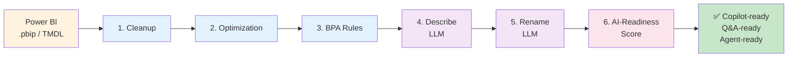
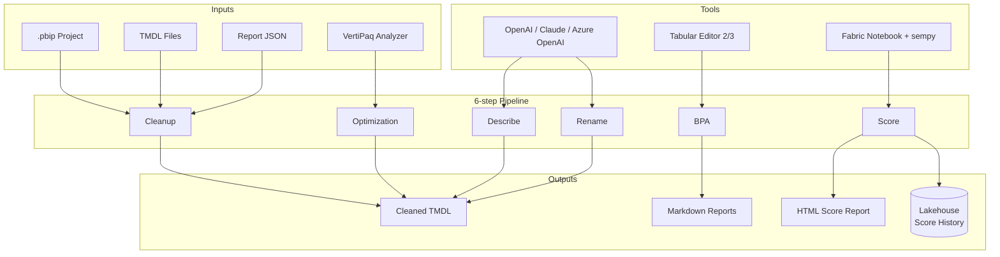
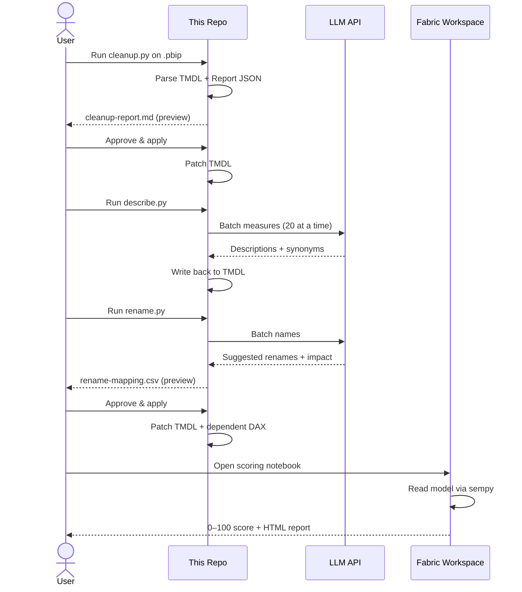

# 🏗️ Architecture

## Pipeline Flow

## Component Diagram

## Sequence — single dataset run

## Tech Stack

| Layer | Tool |
|-------|------|
| Model parsing | TMDL Python parser (custom) + lxml |
| BPA | Tabular Editor 2 (CLI) or 3 (GUI) |
| LLM | OpenAI GPT-4o-mini / Claude Sonnet / Azure OpenAI |
| Scoring | sempy in Fabric notebook |
| Storage | Fabric Lakehouse (score history) |
| Orchestration | Python scripts or Fabric pipelines |
